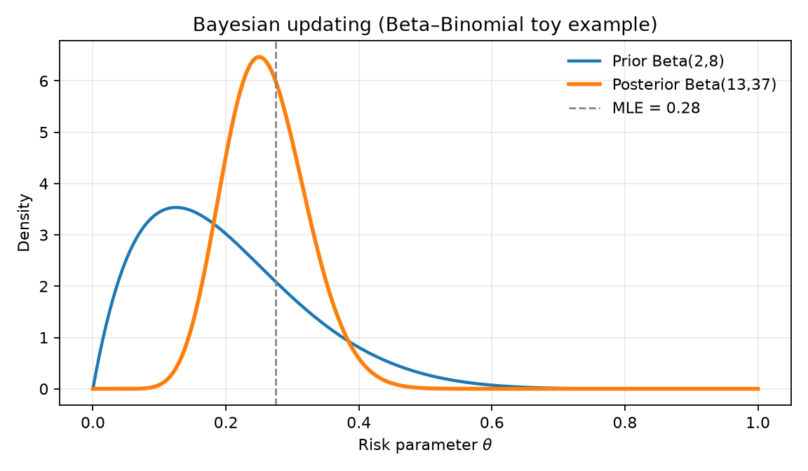
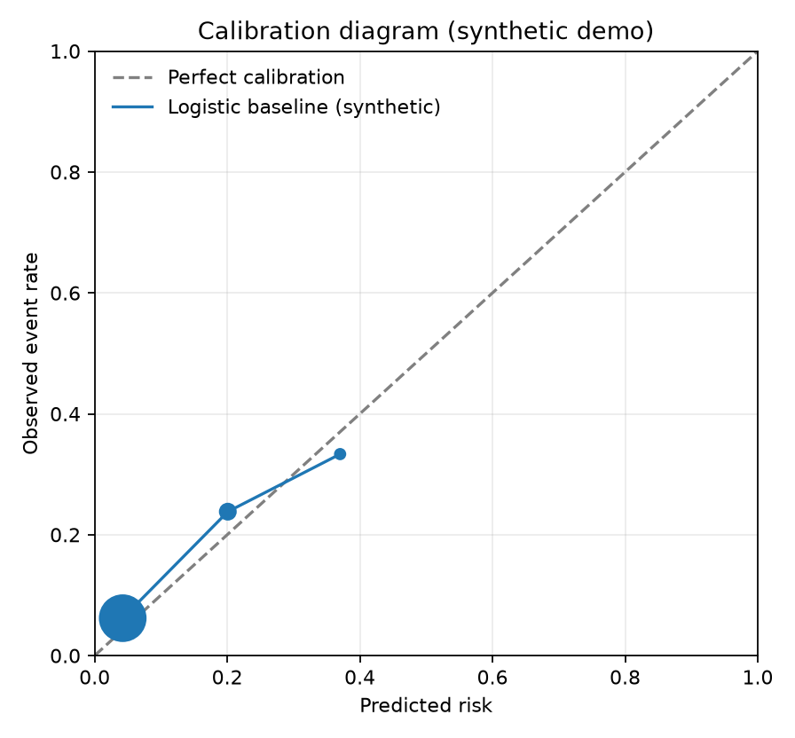
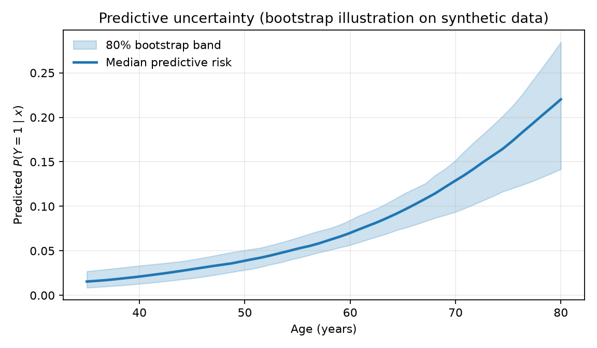

# Bayesian Breast-Cancer Prediction — Research Repository

**Petitioner / author:** Osayimwense Godsent Izinyon  
**Purpose:** Reproducible research infrastructure for uncertainty-aware Bayesian modeling of breast-cancer risk / related clinical prediction endpoints, with transparent classical baselines, calibration-first evaluation, and software-ready analysis pipelines.

> **Disclaimer:** This repository is **research infrastructure**, not a medical device or clinical decision-support product. Figures below use **synthetic / toy data** for methodology display only.

---

## Methods display (formulas + figures)

*Print this GitHub README (or open [`docs/methods-one-pager.md`](docs/methods-one-pager.md)) to PDF for Exhibit 17.*

### Logistic risk model

For person \(i\), event \(Y_i \in \{0,1\}\) and predictors \(x_i\):

$$
Y_i \mid x_i,\beta \sim \mathrm{Bernoulli}(\pi_i),
\qquad
\pi_i = \sigma(x_i^\top\beta) = \frac{1}{1+e^{-x_i^\top\beta}}.
$$

### Prior and posterior

$$
\beta_j \sim \mathcal{N}(0,\tau^2),
\qquad
p(\beta \mid y,X) \propto p(y \mid X,\beta)\,p(\beta).
$$

### Posterior predictive probability

$$
p(y_{\mathrm{new}}=1 \mid x_{\mathrm{new}}, y, X)
=
\int \sigma(x_{\mathrm{new}}^\top\beta)\, p(\beta \mid y,X)\, d\beta.
$$

### Hierarchical partial pooling (sketch)

$$
\beta_{0s} \sim \mathcal{N}(\mu_0,\sigma_0^2),
\qquad
\mu_0 \sim \mathcal{N}(0,\tau_\mu^2).
$$

### Beta–Binomial warm-up (conjugate update)

$$
\theta \sim \mathrm{Beta}(a,b),
\quad
Y\sim\mathrm{Binomial}(n,\theta),
\quad
\theta\mid y \sim \mathrm{Beta}(a+y,\,b+n-y).
$$

### Figure 1 — Bayesian updating (prior → posterior)



*Toy conjugate example: prior belief updates after observing data; posterior concentrates around the MLE.*

### Figure 2 — Calibration diagram (synthetic logistic baseline)



*Predicted risk vs observed event rate. Perfect calibration lies on the diagonal. This is a core evaluation target of the endeavor.*

### Figure 3 — Predictive uncertainty band



*Median predictive risk by age with an 80% uncertainty band (bootstrap illustration on synthetic data).*

Full write-up: [`docs/bayesian-models.md`](docs/bayesian-models.md) · regenerate figures: `python scripts/make_figures.py`

---

## Status (started August 2026)

| Artifact | Location | Status |
| --- | --- | --- |
| Research protocol | [`docs/protocol.md`](docs/protocol.md) | Draft v0.1 |
| Data / access plan | [`docs/data.md`](docs/data.md) | Draft v0.1 |
| Manuscript outline | [`docs/manuscript-outline.md`](docs/manuscript-outline.md) | Draft v0.1 |
| Model card stub | [`docs/model-card.md`](docs/model-card.md) | Stub |
| Bayesian formulas + figures | [`docs/bayesian-models.md`](docs/bayesian-models.md), [`docs/figures/`](docs/figures/) | On main README |
| Methods one-pager (print) | [`docs/methods-one-pager.md`](docs/methods-one-pager.md) | For PDF save |
| Baseline notebook | [`notebooks/01_baseline_logistic_calibration.ipynb`](notebooks/01_baseline_logistic_calibration.ipynb) | Synthetic demo |
| Bayesian illustrations notebook | [`notebooks/02_bayesian_illustrations.ipynb`](notebooks/02_bayesian_illustrations.ipynb) | Synthetic demo |
| Environment | [`environment.yml`](environment.yml), [`requirements.txt`](requirements.txt) | Defined |
| Tests | [`tests/`](tests/) | Smoke tests |

## Design principles (aligned to the proposed endeavor)

1. **Prespecify before comparing.** Population, outcome, predictors, splits, and metrics are written down before model shopping.
2. **Calibration before novelty.** Discrimination alone is not enough; calibration, proper scoring rules, and uncertainty are first-class.
3. **Baselines first.** Transparent classical models run before hierarchical / fully Bayesian extensions.
4. **No restricted data in git.** Only synthetic or explicitly public demonstration data live in this repository.
5. **Reproducible environments.** Dependencies are pinned; key calculations are tested.

## Quick start

```bash
python -m venv .venv
source .venv/bin/activate   # Windows: .venv\Scripts\activate
pip install -r requirements.txt
pytest -q
python scripts/make_figures.py
jupyter lab notebooks/01_baseline_logistic_calibration.ipynb
```

Or with conda:

```bash
conda env create -f environment.yml
conda activate bbc-prediction
```

## Repository map

```
docs/           Protocol, methods display, figures, data plan
notebooks/      Analysis notebooks (baselines → Bayesian)
src/bbc/        Small reusable Python helpers
data/synthetic/ Public synthetic demo data only
scripts/        Figure generation
tests/          Unit / smoke tests
```

## Citation

If you use this repository, please cite the repository URL and version/tag, and the author's related peer-reviewed prediction / clinical-embedding work as appropriate.

## License

Code is released under the MIT License (see [`LICENSE`](LICENSE)). Documentation may be reused with attribution. Do not represent analyses from this repo as clinically validated tools.
